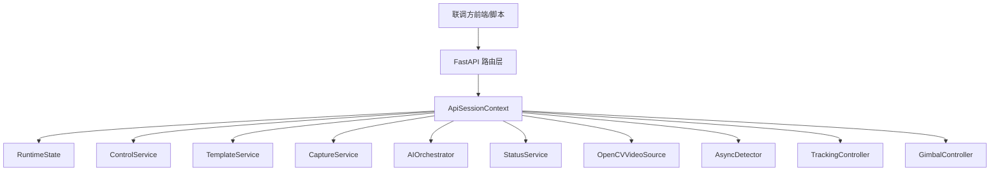

# 联调接入说明与当前接口边界

## 1. 文档目的

这份文档用于回答两个问题：

1. 当前项目已经对外提供了哪些真实可联调能力
2. 当前仍未开放、仍属于后续扩展的能力有哪些

它不是新的接口草案，而是基于当前代码实现的联调边界说明。

## 2. 当前接入结论

当前项目已经从“只有 Tkinter GUI 能点”推进到“GUI 和 API 共用同一套核心 service”的状态。

已具备首轮联调条件的能力：

- 会话打开/关闭
- 状态查询
- 模板导入/查询/选择/删除
- 模式切换
- 手动控制
- 回中
- 手动抓拍
- AI 自动找角度
- AI 背景扫描锁机位
- AI 解除锁机位

## 3. 当前系统边界

### 3.1 我方当前提供

- 视频流接入与实时识别链
- 自动跟随控制
- 模板构图评分链
- 手动抓拍与抓拍后分析链
- AI 自动找角度链
- AI 背景锁机位链
- 对外 FastAPI 接口

### 3.2 当前不提供

- 鉴权系统
- 多会话并发
- 事件推送通道
- 前端页面
- 外部数据库模板仓储实现
- 逐帧 push 视频输入

## 4. 当前实际结构

当前对接结构如下：

关键点：

- API 不再是一次性局部变量拼装
- `open_session` 建立真实上下文
- 后续接口复用同一份会话
- `close_session` 释放资源

## 5. 当前真实状态契约

当前 GUI、service、API 已统一使用 `RuntimeState` 保存关键状态。

对联调方最重要的字段有：

- `mode`
- `follow_mode`
- `speed_mode`
- `selected_template_id`
- `compose_score`
- `compose_ready`
- `tracking_stable`
- `ai_angle_search_running`
- `ai_lock_mode_enabled`
- `ai_lock_fit_score`
- `ai_lock_target_box_norm`
- `latest_capture_path`
- `last_angle_search_result`
- `last_angle_search_error`
- `last_background_lock_result`
- `last_background_lock_error`

## 6. 当前接口边界

### 6.1 已实现接口

#### 会话

- `POST /api/v1/session/open`
- `POST /api/v1/session/close`

#### 状态

- `GET /api/v1/status`
- `GET /api/v1/status/mode`
- `GET /api/v1/status/compose`
- `GET /api/v1/status/tracking`
- `GET /api/v1/status/ai`

#### 模板

- `POST /api/v1/templates/import`
- `GET /api/v1/templates/`
- `POST /api/v1/templates/select`
- `DELETE /api/v1/templates/{template_id}`

#### 控制

- `POST /api/v1/control/mode`
- `POST /api/v1/control/manual-move`
- `POST /api/v1/control/home`
- `POST /api/v1/control/follow-mode`
- `POST /api/v1/control/speed`

#### 抓拍

- `POST /api/v1/capture/manual`

#### AI

- `POST /api/v1/ai/analyze-upload`
- `POST /api/v1/ai/angle-search/start`
- `POST /api/v1/ai/background-lock/start`
- `POST /api/v1/ai/background-lock/unlock`

### 6.2 当前未实现接口

下面这些能力曾出现在早期草案里，但当前版本还没有对外接口：

- 单图评分上传接口
- 单图背景分析上传接口
- 模板 + 背景联合指导接口
- 识别结果明细接口
- WebSocket/SSE 事件接口
- 远程模板仓储接口
- 逐帧视频 push 接口

## 7. 当前联调建议

### 7.1 视频接入

首版建议直接通过 `stream_url` 对接：

- RTSP
- HTTP MJPEG
- 其他可被 OpenCV 打开的流

不建议首版就走逐帧 HTTP 上传，因为这会引入更多时延和协议复杂度。

### 7.2 模板接入

当前模板上传已经能真实进入 `TemplateService.import_template()`。

联调时可以先接受下面这件事：

- 联调方上传模板图片
- 我方当前仍把模板持久化到本地模板库

后续如果需要接入联调方数据库，再在 `TemplateRepository` 之上补远程实现即可，不需要重写模板评分逻辑。

### 7.3 AI 接入

当前 AI 异步任务的正确调用方式是：

1. 调用启动接口
2. 立刻收到“已启动”
3. 轮询 `GET /api/v1/status` 或 `GET /api/v1/status/ai`
4. 读取结果字段或错误字段

不要把启动接口的立即返回误解成最终分析结果。

## 8. 当前限制

联调时需要明确以下限制：

- 单活会话，打开新会话会关闭旧会话
- 当前 API 会话默认使用 `MockServoDriver()`
- 未配置真实 `SILICONFLOW_API_KEY` 时会走 Mock AI
- 当前没有鉴权
- 当前没有事件推送，只能轮询状态

## 9. 推荐联调里程碑

### 里程碑 1

- 打通 `session/open`
- 打通 `status`
- 打通模板上传

### 里程碑 2

- 打通模式切换
- 打通手动控制
- 打通手动抓拍

### 里程碑 3

- 打通 `ai/angle-search/start`
- 打通 `ai/background-lock/start`
- 轮询状态拿到结果

### 里程碑 4

- 用真实流验证
- 用真实 AI Key 验证
- 补 GUI 与 API 同时运行时的联动回归

## 10. 相关文档

- `docs/API_QUICKSTART.md`
  联调方直接调用用的接口说明
- `docs/PROJECT_DOCUMENTATION.md`
  当前实现结构说明
- `docs/REFACTOR_TASKS.md`
  本轮修复进度与未闭环事项
- `docs/SMOKE_CHECKLIST.md`
  最小验证清单
